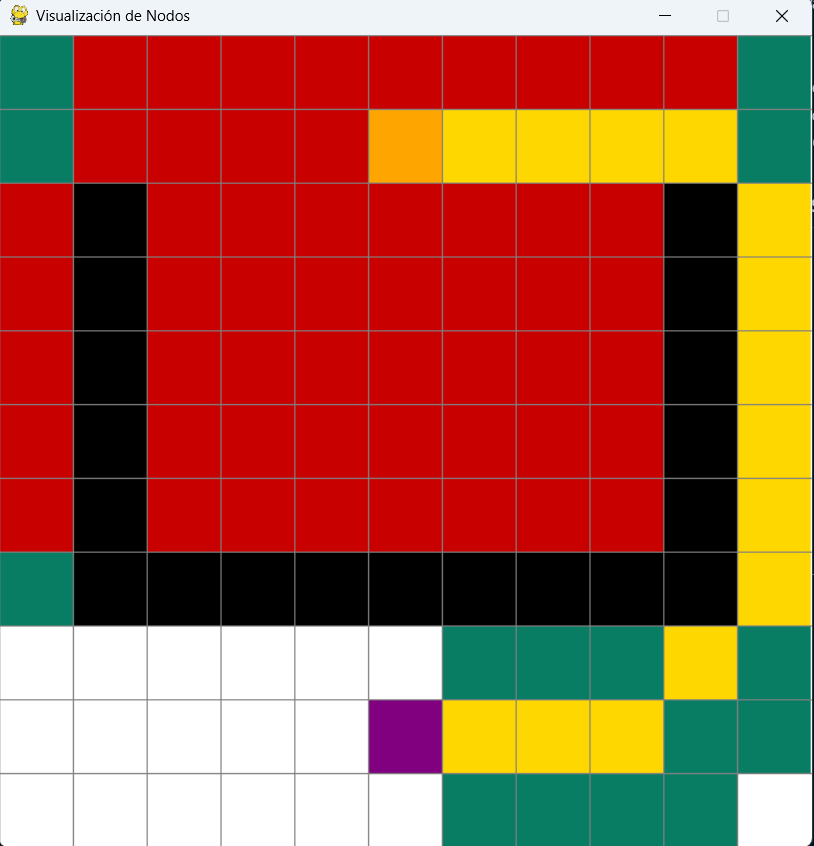
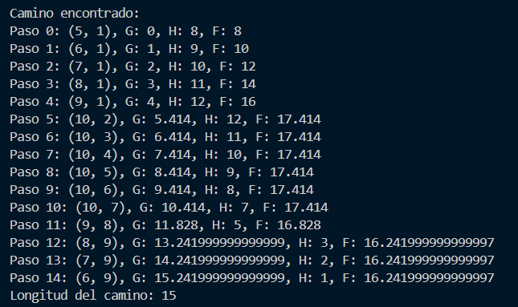
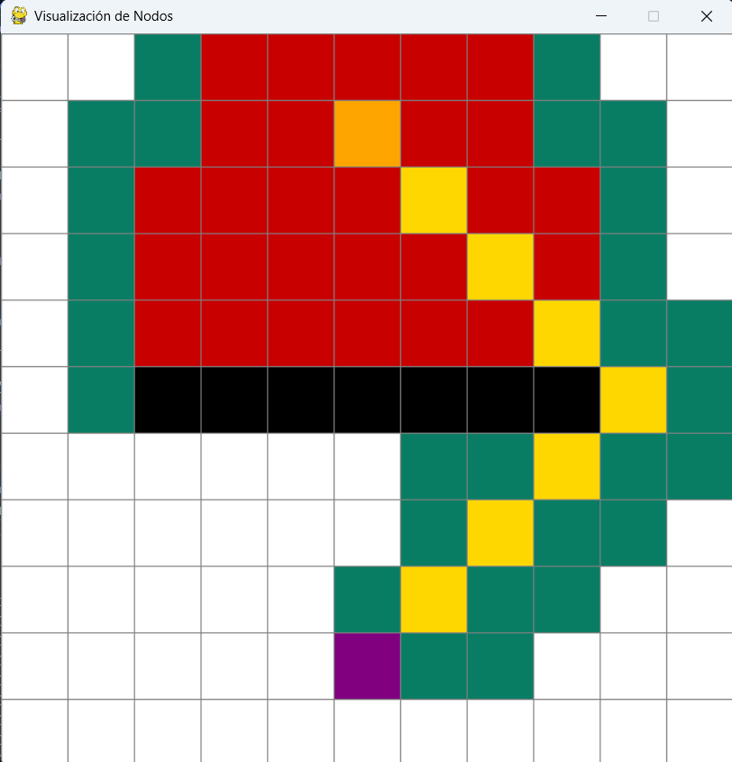
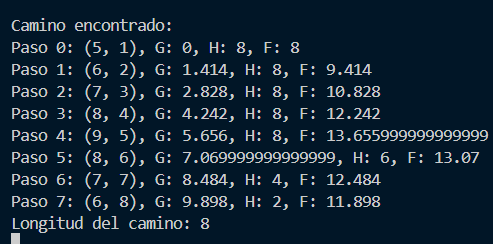

# Implementación del Algoritmo de Búsqueda A*

Este documento explica una implementación en Python del algoritmo de búsqueda de caminos A* con visualización utilizando Pygame.

## Visión General

El proyecto consta de dos archivos principales:
1. `algoritmo_nuevo.py` - Contiene la implementación principal del algoritmo A*
2. Un archivo de visualización basado en Pygame para crear y mostrar la cuadrícula, los nodos y el proceso de búsqueda de caminos

La implementación permite a los usuarios:
- Crear una cuadrícula
- Establecer puntos de inicio y fin
- Dibujar paredes/obstáculos
- Visualizar el algoritmo A* encontrando el camino más corto

## Tabla de Contenidos
- [Componentes Principales](#componentes-principales)
- [Implementación del Algoritmo](#implementación-del-algoritmo)
- [Visualización](#visualización)
- [Cómo Funciona A*](#cómo-funciona-a)
- [Interacción del Usuario](#interacción-del-usuario)

## Componentes Principales

### Clase Nodo

La clase `Nodo` representa cada celda en la cuadrícula con propiedades:
- Posición (fila, columna)
- Coordenadas en píxeles
- Color (representando el estado: pared, inicio, fin, etc.)
- Información de tamaño

Los métodos clave incluyen:
- `get_pos()` - Devuelve las coordenadas de la cuadrícula
- Métodos de verificación de estado (`es_pared()`, `es_inicio()`, `es_fin()`)
- Métodos de establecimiento de estado (`hacer_inicio()`, `hacer_pared()`, `hacer_fin()`, `restablecer()`)
- `dibujar()` - Renderiza el nodo en pantalla

### Clase Algoritmo

La clase `Algoritmo` implementa el algoritmo A* con:
- Lista abierta (nodos por evaluar)
- Lista cerrada (nodos ya evaluados)
- Seguimiento de padres para la reconstrucción del camino
- Cálculo de heurística (distancia de Manhattan)

## Implementación del Algoritmo

La implementación de A* sigue estos pasos:

1. **Inicialización**
   ```python
   def __init__(self, informacion, board, update_callback):
       # Inicializar estructuras de datos
       self.informacion = informacion  # Diccionario con coordenadas y tipos de nodos
       self.board = board              # Tablero de juego
       self.lista_cerrada = set()      # Lista cerrada (nodos evaluados)
       self.lista_abierta = {}         # Lista abierta con costos
       self.update_callback = update_callback  # Función de actualización de UI
       self.parents = {}               # Seguimiento de padres para el camino
       self.camino = []                # Camino final
       self.nodos_datos = {}           # Almacena datos de nodos
   ```

2. **Definición de Nodos de Inicio y Fin**
   ```python
   def definir_inicio_fin(self):
       for coor, nodo in self.informacion.items():
           if nodo.es_inicio():
               self.coor_inicio = coor
               self.lista_cerrada.add(coor)
           elif nodo.es_fin():
               self.coor_fin = coor
           elif nodo.es_pared():
               self.lista_cerrada.add(coor)
   ```

3. **Cálculo de Heurística**
   ```python
   def heuristic(self, a, b):
       # Utiliza la distancia de Manhattan
       return np.sum(np.abs(np.array(a) - np.array(b)))
   ```

4. **Búsqueda de Vecinos**
   ```python
   def encontrar_vecinos(self, curr_coor, datos):
       """
        Busca los vecinos del nodo actual, y los agrega a la lista abierta si no estan en la lista cerrada.
        Ademas, si encuentra el nodo final, guarda el padre del nodo final y devuelve True.

        :param curr_coor: Coordenadas del nodo actual.
        :type curr_coor: tuple
        :param datos: Tuple con los valores de G, H y F del nodo actual.
        :type datos: tuple
        :return: True si encuentra el nodo final, False en caso contrario.
        :rtype: bool
        """

        curr_x, curr_y = curr_coor

        # g es el costo de llegar al vecino
        # h es la distancia entre, el vecino y el final
        # f es la suma de g y h

        g, h, f = None, None, None
        
        # El costo de las direcciones sera 10 para mov uni
        direcciones = [
            (+1, 0, 1),    # Derecha 
            (-1, 0, 1),    # Izquierda 
            (0, +1, 1),    # Arriba
            (0, -1, 1),    # Abajo 
            (+1, +1, 1.414),   # Diagonal derecha arriba
            (+1, -1, 1.414),   # Diagonal derecha abajo 
            (-1, +1, 1.414),   # Diagonal izquierda arriba
            (-1, -1, 1.414)    # Diagonal izquierda abajo
        ]
        
        for dx, dy, costo in direcciones:
            next_x, next_y = curr_x + dx, curr_y + dy
            vecino_coor = (next_x, next_y)

            # Comprobamos si las coordenadas son validas y ademas no esten en la lista cerrada
            # la coordenada en x es mayor a 0 y menor a la longitud del tablero
            # la coordenada en y es mayor a 0 y menor a la longitud del tablero
            if (0 <= next_x < len(self.board) and 0 <= next_y < len(self.board[0])) and (vecino_coor not in self.lista_cerrada):
                
                # Verificamos si el vecino es el final
                if vecino_coor == self.coor_fin:
                    # Guardamos el padre del nodo final
                    self.parents[vecino_coor] = curr_coor
                    return True
    
                # Cambiamos el color de la casilla, para saber que es un vecino
                self.board[next_x][next_y].color = (9, 125, 100)

                # guardamos la coordenada
                next_coor = (next_x, next_y)
    
                # Calculamos los nuevos valores
                g = costo + datos[0]
                h = self.heuristic(next_coor, self.coor_fin) 
                f = g + h
                
                # Verificamos que no esté en la lista abierta o si el nuevo camino es mejor
                if next_coor not in self.lista_abierta or g < self.lista_abierta[next_coor][0]:
                    self.lista_abierta[next_coor] = (g, h, f)
                    self.parents[next_coor] = curr_coor
                    
                    # Imprimimos por consola
                print(f"Nodo: {next_coor}, G: {g}, H: {h}, F: {f}")

                self.update_callback()
                time.sleep(0.05)
                
        return False
   ```

5. **Reconstrucción del Camino**
   ```python
   def reconstruir_camino(self):
       # Reconstruye el camino desde el final hasta el inicio
       # Visualiza el camino en el tablero
   ```

6. **Método Principal de Resolución**
   ```python
   def resolver(self):
        """
        Resuelve el problema de encontrar el camino más corto en un tablero
        desde un nodo inicial hasta un nodo final utilizando el algoritmo A*.

        El método define los nodos inicial y final, y utiliza una cola de
        prioridad para expandir los nodos más prometedores, calculando los
        valores de g, h y f para cada nodo. Si se encuentra un camino al
        nodo final, este se reconstruye y se marca en el tablero. En caso
        contrario, informa que no se encontró un camino.

        :raises ValueError: Si no existe un nodo de inicio o fin definido.
        """

        self.definir_inicio_fin()
        if self.coor_inicio is None or self.coor_fin is None:
            print("No hay inicio o fin definidos")
            return
        
        self.lista_abierta[self.coor_inicio] = (0, self.heuristic(self.coor_inicio, self.coor_fin), self.heuristic(self.coor_inicio, self.coor_fin))
        
        found_path = False

        while self.lista_abierta:
            # Encontrar la coordenada con menor f
            self.curr_coor = min(self.lista_abierta, key=lambda k: (self.lista_abierta[k][2]))
            
            # Actualizar self.datos con los valores del nodo actual - ESTA ES LA LÍNEA CLAVE QUE FALTA
            self.datos = self.lista_abierta[self.curr_coor]
            
            # Si llegamos al final, terminamos
            if self.curr_coor == self.coor_fin:
                found_path = True
                break
                
            # Eliminarlo de la lista abierta y guardarlo en nodos_datos
            self.nodos_datos[self.curr_coor] = self.datos
            del self.lista_abierta[self.curr_coor]
            
            # Agregamos la coordenada actual a la lista cerrada
            self.lista_cerrada.add(self.curr_coor)
            
            # Cambiar color para mostrar que está en la lista cerrada (explorado)
            if self.curr_coor != self.coor_inicio and self.curr_coor != self.coor_fin:
                x, y = self.curr_coor
                self.board[x][y].color = (200, 0, 0)  # Rojo para nodos explorados
                self.update_callback()
            
            # Buscar vecinos
            if self.encontrar_vecinos(self.curr_coor, self.datos):
                found_path = True
                break
        
        if found_path:
            self.reconstruir_camino()
        else:
            print("No se encontró un camino")
   ```

## Visualización

La visualización utiliza Pygame para:

1. **Crear la Cuadrícula**
   ```python
   def crear_grid(filas, ancho):
       # Crea matriz de nodos
   ```

2. **Dibujar la Cuadrícula**
   ```python
   def dibujar_grid(ventana, filas, ancho):
       # Dibuja líneas de la cuadrícula
   ```

3. **Renderizar Todo**
   ```python
   def dibujar(ventana, grid, filas, ancho):
       # Dibuja nodos y actualiza pantalla
   ```

4. **Interacción del Usuario**
   - Click izquierdo: crear nodos inicio/fin/paredes
   - Click derecho: borrar nodos
   - Tecla 'b': iniciar búsqueda
   - Tecla 'r': reiniciar

## Cómo Funciona A*

El algoritmo A* es una técnica de búsqueda informada que:

1. Mantiene dos listas:
   - **Lista Abierta**: Nodos descubiertos pero no evaluados
   - **Lista Cerrada**: Nodos ya evaluados

2. Para cada nodo, calcula tres valores:
   - **g**: Costo acumulado desde el nodo inicial hasta el nodo actual
   - **h**: Heurística - costo estimado desde el nodo actual hasta el destino
   - **f**: Suma de g + h (costo total estimado)

3. En cada iteración:
   - Selecciona el nodo con menor valor f de la lista abierta
   - Examina todos sus vecinos
   - Para cada vecino, calcula valores g, h y f
   - Agrega vecinos a la lista abierta si no están en la lista cerrada o tienen mejor camino

4. El algoritmo termina cuando:
   - Se encuentra el nodo destino
   - La lista abierta se vacía (no hay camino posible)

5. Finalmente, reconstruye el camino siguiendo los punteros de padres desde el destino hasta el inicio

## Interacción del Usuario

1. **Crear el Tablero**:
   - Ejecutar el programa
   - Hacer click izquierdo para colocar:
     - Primer click: nodo inicio (naranja)
     - Segundo click: nodo fin (púrpura)
     - Clicks siguientes: paredes (negro)
   - Click derecho para borrar nodos

2. **Ejecutar el Algoritmo**:
   - Presionar 'b' para iniciar la búsqueda
   - Observar la visualización:
     - Rojo: nodos explorados (lista cerrada)
     - Verde claro: nodos en consideración (lista abierta)
     - Dorado: camino óptimo encontrado

3. **Reiniciar**:
   - Presionar 'r' para limpiar el tablero

## Detalles de Implementación

### Valores de g, h, f
- **g**: Incrementa en 1 para movimientos cardinales y √2 (1.414) para diagonales
- **h**: Utiliza la distancia de Manhattan (suma de diferencias absolutas en x e y)
- **f**: Suma de g + h, utilizada para priorizar qué nodo expandir

### Visualización de Colores
- **Blanco**: Nodo no explorado
- **Negro**: Pared/obstáculo
- **Naranja**: Nodo inicio
- **Púrpura**: Nodo fin
- **Rojo**: Nodo explorado (en lista cerrada)
- **Verde**: Nodo en consideración (en lista abierta)
- **Dorado**: Camino final óptimo

## Resultados
**Test 1**
<br />

<br />
**Output en consola del Test 1**
<br />

**Test 2**

<br />
**Output en consola del Test 2**
<br />

