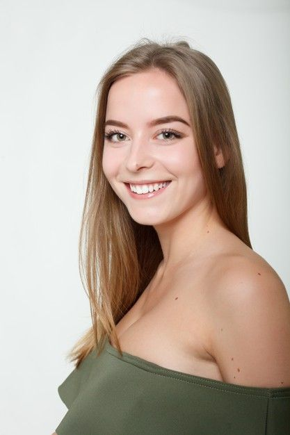

# Modelar si una persona se encuentra:
# * Feliz
# * Triste
# * O si estamos hablando

## Caso: feliz
Para poder detectar si una persona esta feliz, podemos poner los puntos: (61, 29) que hacen referencia a la boca, posteriormente podemos sacar la distancia entre esos dos puntos y estarla guardando, una vez guardada podemos ver los valores más pequeños, harán referencia cuando tiene la boca en "estado normal", en reposo, si la distancia aumenta quiere decir que la persona esta haciendo una ligera sonrisa, pero para verificar si verdaderamente esta sonriendo podemos centrarnos en los puntos (13,14) pertenecen al labio inferior y el labio superior en la parte central, si esta distancia aumenta junto con los puntos previos estamos hablando que la persona esta sonriendo.

## Caso: Triste
En este caso, para detectar si una persona está triste nos enfocaremos en las cejas (46, 55), (70, 107) -> ceja izquierda, (285, 276), (336, 300) -> ceja derecha y los labios, ya que generalmente las cejas nos ayudan a detectar preocupación,  a su vez que un indicativo si la persona esta triste generalmente suelen caer los labios.  
En escencia: Cejas inclinadas + boca hacia abajo = Persona triste

## Caso: Hablando
Para este caso podemos mapear los puntos 205 y 425, correspondientes a las mejillas, para ver si tienen algún cambio en su cordenada "y", lo que podria ser un indicativo que una persona esta hablando, ya que al momento pronunciar ciertas palabras, algunas personas tendemos a mover las mejillas, pero para tener más certeza también podemos fijarnos en los puntos: 13 y 14 a mí opinión son los puntos de maor relevancia, porque son el punto medio de los labios superior como inferior y estos al momento de hablar tienen a moverse en la coordenada "y".

## Referencia de los puntos mencionados.

